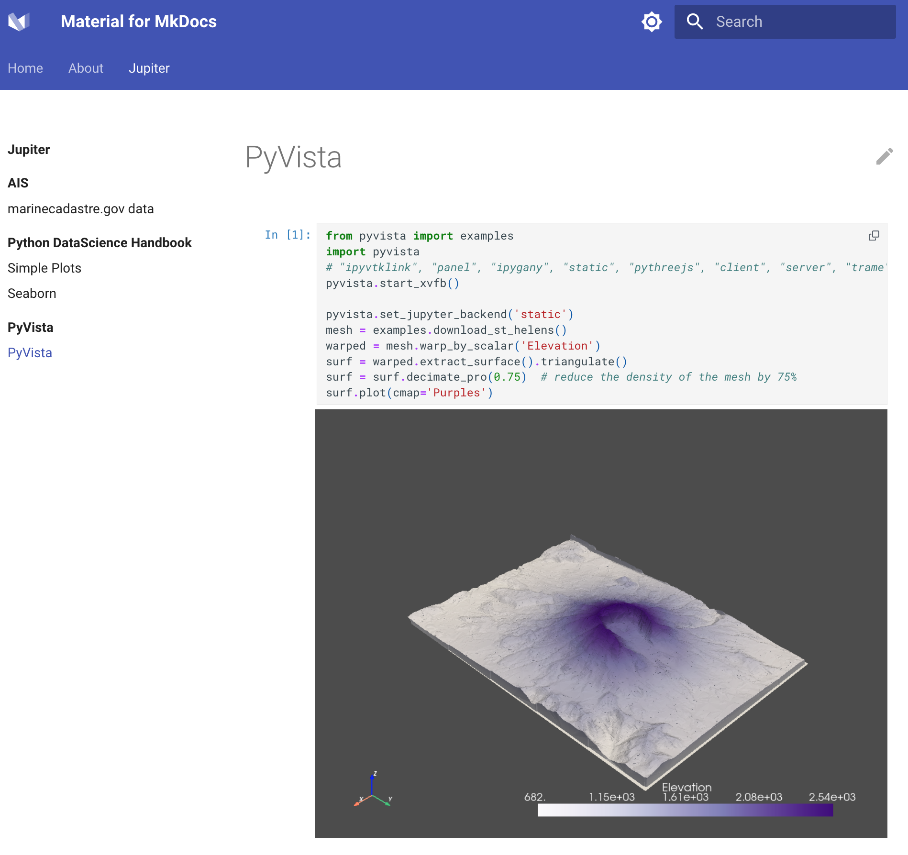

This repository generates a docker container, containing mkdocs with material theme to generate static sites which can contain jupyter notebooks which can contain pyvista elements.

The documentation and examples are generated with its own docker container and can be found at https://marcelmaatkamp.github.io/mkdocs-material-jupyter-pyvista/jupyter/pyvista/pyvista/\

